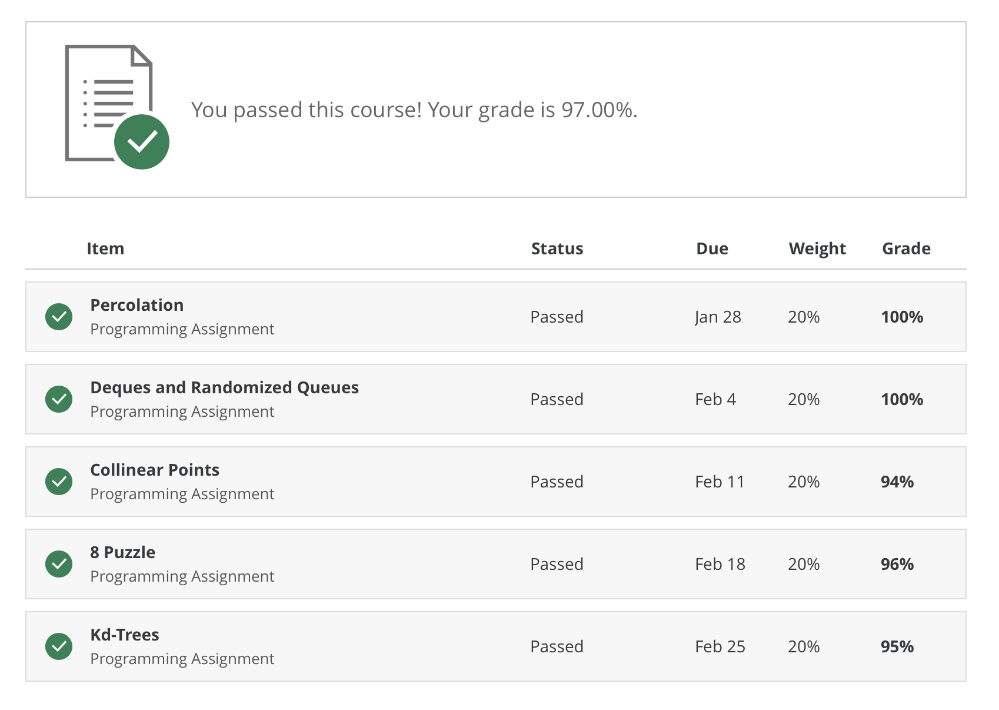

# Algorithms by Princeton University

### Taught by:  
    Robert Sedgewick, William O. Baker *39 Professor of Computer Science
    Kevin Wayne, Phillip Y. Goldman '86 Senior Lecturer

** Final Score: 97/100 ** 

